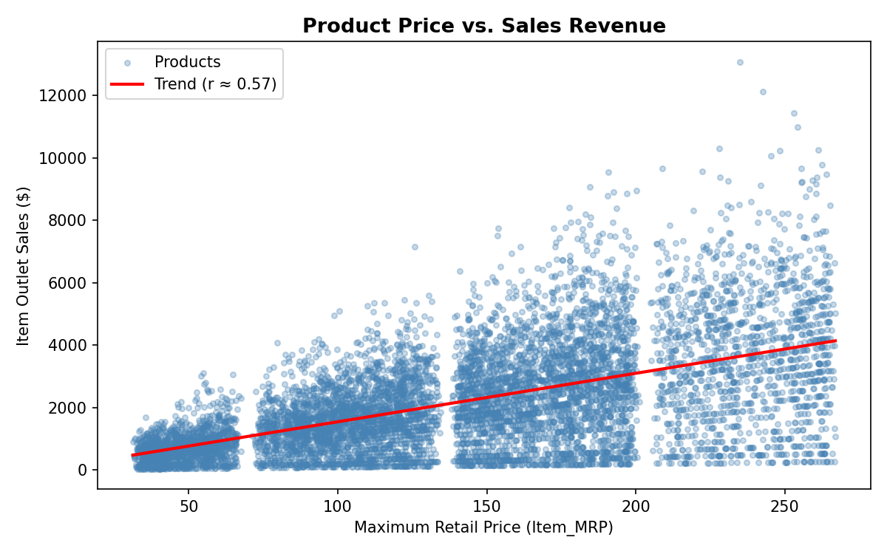
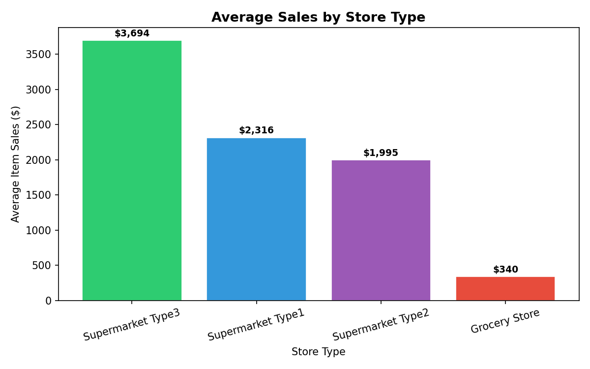
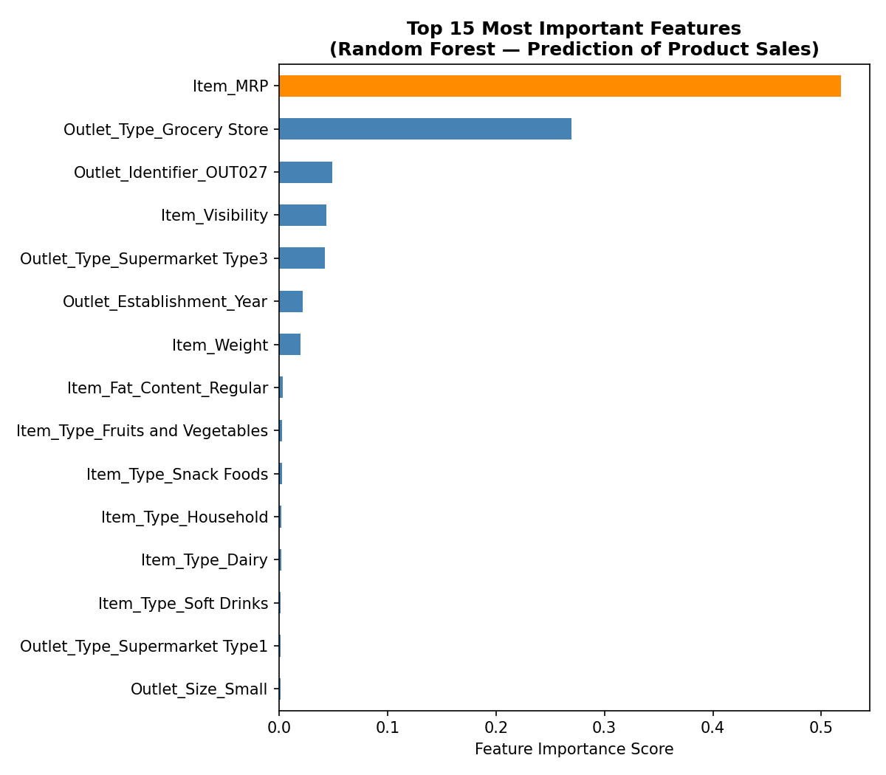

# Prediction of Product Sales

### Author: Salam Odeh | Data Science Portfolio Project

---

## Project Overview

Retailers carry thousands of products across multiple store types and locations. Understanding **which products sell well — and why** is critical for inventory planning, shelf-space allocation, and revenue forecasting.

This project applies the full **CRISP-DM data science process** to a retail sales dataset containing **8,523 product-outlet combinations** across 10 store locations. The goal is to build a machine learning model that predicts `Item_Outlet_Sales` — the dollar amount a product generates at a specific outlet — based on product and store attributes.

**Business question:** *What properties of products and outlets play the most crucial role in predicting sales?*

---

## Dataset

**Source:** BigMart Sales Dataset (2023) — `sales_predictions_2023.csv`  
**Size:** 8,523 rows × 12 columns

| Variable | Type | Description |
|---|---|---|
| Item_Identifier | Categorical | Unique product ID |
| Item_Weight | Numeric | Weight of product |
| Item_Fat_Content | Categorical | Low Fat or Regular |
| Item_Visibility | Numeric | % of store display area allocated to this product |
| Item_Type | Categorical | Product category (16 types) |
| Item_MRP | Numeric | Maximum Retail Price (list price) |
| Outlet_Identifier | Categorical | Unique store ID |
| Outlet_Establishment_Year | Numeric | Year the store was established |
| Outlet_Size | Categorical | Small / Medium / High |
| Outlet_Location_Type | Categorical | Area tier (Tier 1 / 2 / 3) |
| Outlet_Type | Categorical | Grocery Store or Supermarket Type 1/2/3 |
| **Item_Outlet_Sales** | **Numeric** | **Target — sales in dollars** |

**Data quality issues addressed:**
- `Item_Weight`: 1,463 missing values (17.2%) → median imputation after train/test split
- `Outlet_Size`: 2,410 missing values (28.3%) → `'MISSING'` placeholder category
- `Item_Fat_Content`: inconsistent labels (`low fat`, `LF`, `reg`) → standardized to `Low Fat` / `Regular`

---

## Key Insights

### Insight 1: Product Price is the Strongest Driver of Sales

`Item_MRP` (Maximum Retail Price) is the most important predictor of sales, with a Pearson correlation of **r ≈ 0.57** — the strongest linear relationship with the target among all features.

> *Higher-priced products consistently generate more revenue. Products priced above $150 MRP show disproportionately higher sales. This makes price the most reliable and actionable lever for predicting sales performance.*

---

### Insight 2: Store Type Drives the Largest Difference in Sales

The type of outlet matters more than any product-level attribute. The difference between store types is stark:

| Store Type | Average Item Sales |
|---|---|
| Supermarket Type 3 | **$3,694** |
| Supermarket Type 1 | $2,316 |
| Supermarket Type 2 | $1,995 |
| Grocery Store | **$340** |

> *Grocery Store outlets generate on average **91% less revenue per product** than Supermarket Type 3 stores — the single largest gap in the entire dataset. Store-type mix has a bigger impact on total revenue than any product-level attribute.*

---

## Modeling

### Regression: Predicting Exact Sales Amount

Three models were built and compared to predict `Item_Outlet_Sales` as a continuous value:

| Model | Train R² | Test R² | Test MAE | Test RMSE | Overfit? |
|---|---|---|---|---|---|
| Linear Regression | 0.562 | 0.567 | $844 | $1,096 | No (gap < 0.01) |
| Random Forest (default) | 0.938 | 0.560 | $766 | $1,106 | Yes (gap = 0.38) |
| **Random Forest (tuned)** | **0.700** | **0.597** | **$734** | **$1,055** | **Minimal** |

**✅ Recommended: Tuned Random Forest** — best test performance with controlled overfitting, tuned via GridSearchCV over `max_depth`, `min_samples_leaf`, and `n_estimators`.

### Classification: Predicting High vs. Low Sellers

The regression target was also converted to a binary classification task (above/below median sales = $1,794):

| Model | Train Accuracy | Test Accuracy | Precision | Recall | F1 |
|---|---|---|---|---|---|
| Decision Tree (default) | 100% | 74.3% | 0.74 | 0.74 | 0.74 |
| Random Forest (default) | 100% | 79.7% | 0.79 | 0.79 | 0.79 |
| **Random Forest (tuned)** | **83.7%** | **81.1%** | **0.77** | **0.87** | **0.82** |

**✅ Recommended: Tuned Random Forest** — 81.1% test accuracy, Recall of 87% for high-sellers (minimizing stockouts).

---

## Feature Importance

All three model insight methods (Linear Regression coefficients, Random Forest built-in importance, and permutation importance) agree on the top predictors:

| Rank | Feature | LR Coefficient | RF Importance | Permutation |
|---|---|---|---|---|
| 1 | `Item_MRP` | +984 | 44.1% | 0.734 |
| 2 | `Outlet_Type` | -889 (Grocery) | 19.2% | 0.450 |
| 3 | `Outlet_Identifier` | varies | 7.8% | 0.030 |
| 4 | `Item_Visibility` | moderate | 9.9% | 0.002 |
| 5 | `Outlet_Establishment_Year` | moderate | 4.3% | 0.008 |

> *Triple agreement across all three methods gives high confidence that `Item_MRP` and `Outlet_Type` are the true primary drivers of product sales.*

---

## Business Recommendations

1. **Optimize pricing strategy around `Item_MRP`** — since price is the #1 driver, promotional discounts and premium pricing decisions will have the largest measurable impact on sales performance

2. **Prioritize store-type mix over product mix** — the gap between Grocery Store ($340 avg) and Supermarket Type 3 ($3,694 avg) is enormous; upgrading outlet formats represents the highest-leverage structural investment

3. **Increase shelf visibility for key products** — `Item_Visibility` ranks consistently in the top 5; reallocating display space to high-MRP products in larger outlet formats is a low-cost, data-backed action

4. **Use the classification model for inventory planning** — the 81% accuracy / 87% recall model can flag likely high-sellers in advance, allowing the retailer to pre-stock and reduce costly stockouts

5. **Investigate Outlet OUT027** — this specific Supermarket Type 3 location consistently ranks as a top-performing outlet across all models; understanding what makes it exceptional could inform expansion or management best practices

---

## Model Confidence & Limitations

> *"Our best regression model explains approximately **60% of the variation** in product sales across all product-outlet combinations. On average, predictions are within **$734** of actual sales — useful for ranking and planning, but should be treated as estimates rather than precise forecasts."*

**Known limitations:**
- The remaining 40% of variance likely reflects factors not in this dataset: local competition, seasonal demand, promotions, and customer demographics
- The model should be retrained periodically as market conditions change
- `Item_Identifier` was dropped due to high cardinality (1,559 unique values) — product-level effects are captured through `Item_MRP` and `Item_Type` instead

---

## CRISP-DM Process

| Phase | Notebook | Key Output |
|---|---|---|
| Business Understanding | — | Define target: predict `Item_Outlet_Sales` |
| Data Understanding | `Part2_Load_Clean` | 8,523 rows, 2 columns with nulls, inconsistent categories |
| Data Preparation | `Part3_EDA` + `Part4_Feature_Inspection` + `Part5_Preprocessing` | Clean data, feature insights, preprocessing pipeline |
| Modeling | `Part6_Modeling` | 3 regression models, GridSearchCV tuning |
| Evaluation | `Part6_Modeling` + `Part7_Classification` + `Part8_Model_Insights` | Tuned RF (R²=0.60), classification (81% acc), feature importances |
| Deployment | This README | Insights, recommendations, model confidence statement |

---

## Repository Contents

| File | Description |
|---|---|
| `Part1_Setup.ipynb` | Project structure and notebook headers |
| `Part2_Load_Clean.ipynb` | Data loading, exploration (8-point checklist), cleaning |
| `Part3_EDA.ipynb` | Exploratory visuals: histograms, boxplots, countplots, heatmap |
| `Part4_Feature_Inspection.ipynb` | Full inspection of all 12 features |
| `Part5_Preprocessing.ipynb` | Train/test split + ColumnTransformer preprocessing pipeline |
| `Part6_Modeling.ipynb` | Linear Regression + Random Forest + GridSearchCV + evaluation |
| `Part7_Classification.ipynb` | Binary classification extension (high vs. low seller) |
| `Part8_Model_Insights.ipynb` | Coefficients, feature importances, permutation importance |
| `sales_predictions_2023.csv` | Raw dataset |
| `insight1_price_vs_sales.png` | Price vs. Sales scatter with trend line |
| `insight2_sales_by_outlet_type.png` | Average sales by outlet type bar chart |
| `rf_feature_importance_readme.png` | Random Forest feature importance chart |

---

## Tools & Libraries

**Language:** Python 3  
**Data:** Pandas, NumPy  
**Visualization:** Matplotlib, Seaborn  
**Machine Learning:** scikit-learn — Pipeline, ColumnTransformer, SimpleImputer, StandardScaler, OneHotEncoder, LinearRegression, RandomForestRegressor, RandomForestClassifier, DecisionTreeClassifier, GridSearchCV, permutation_importance
